# CVFX_HW5
  # 1.multi-view images by yourselves
   Stop Motion　
  >
  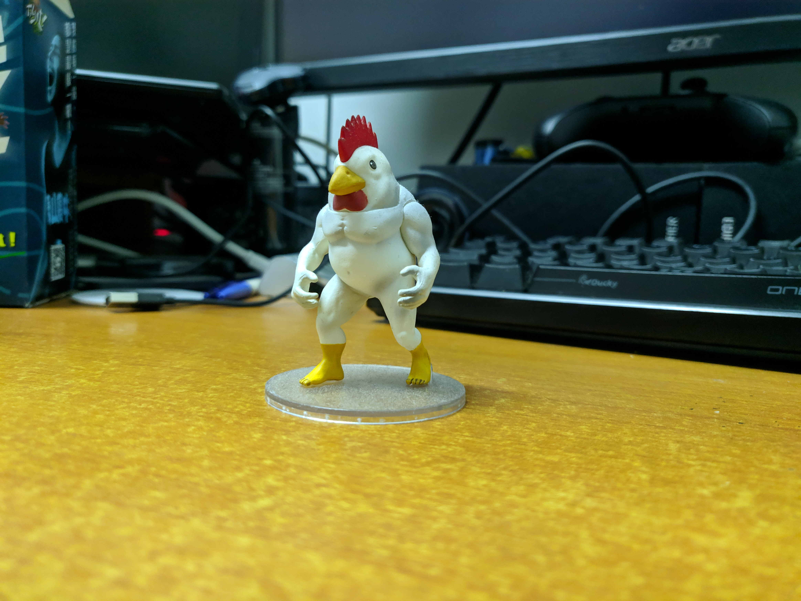  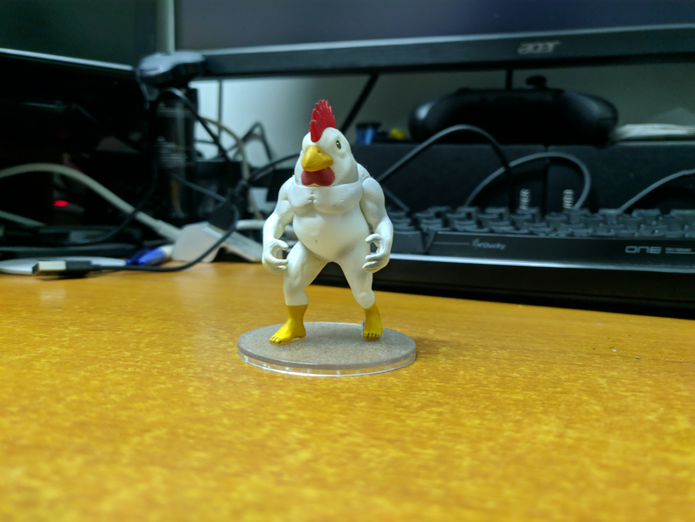
  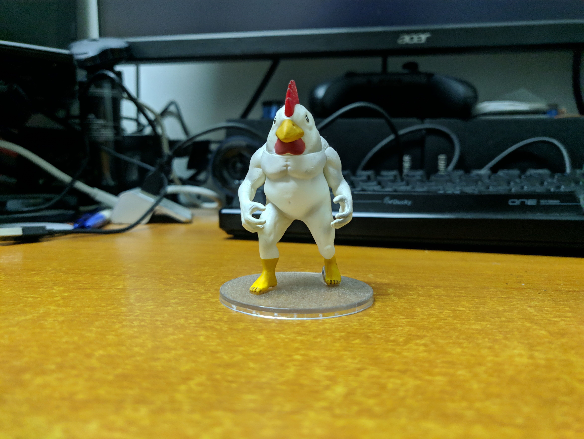  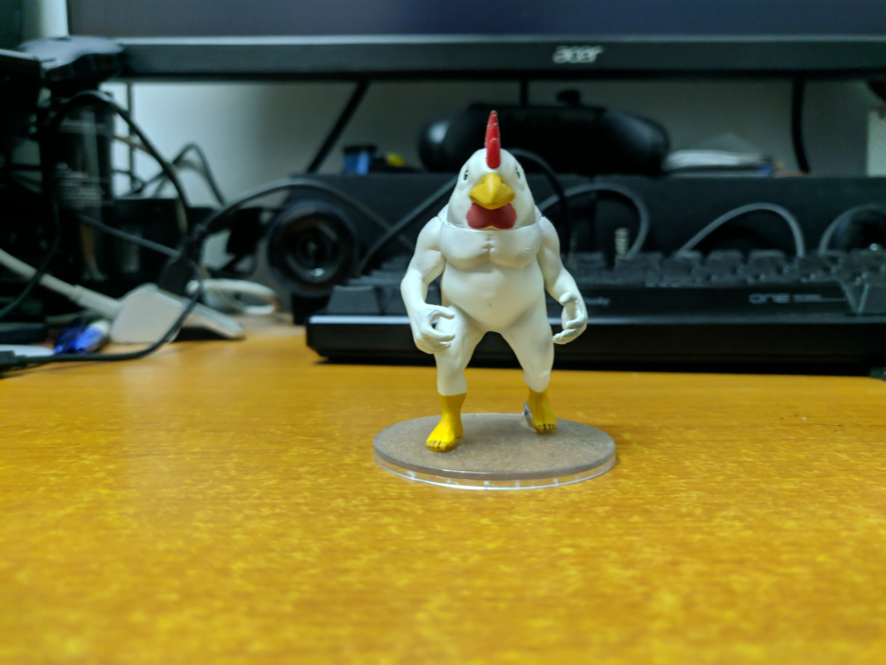
  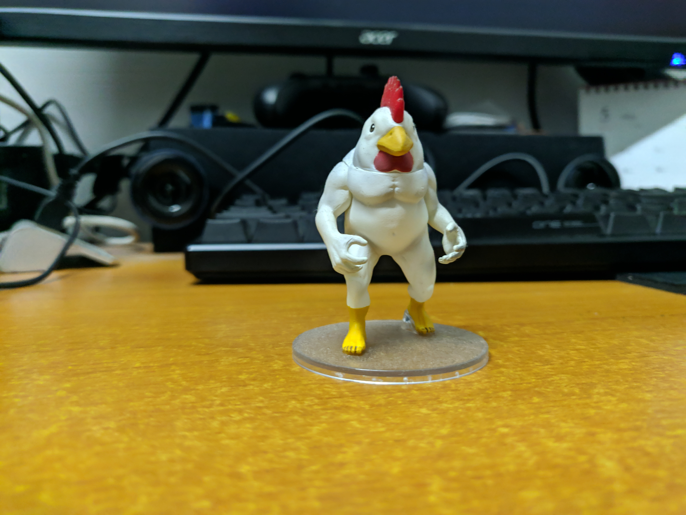  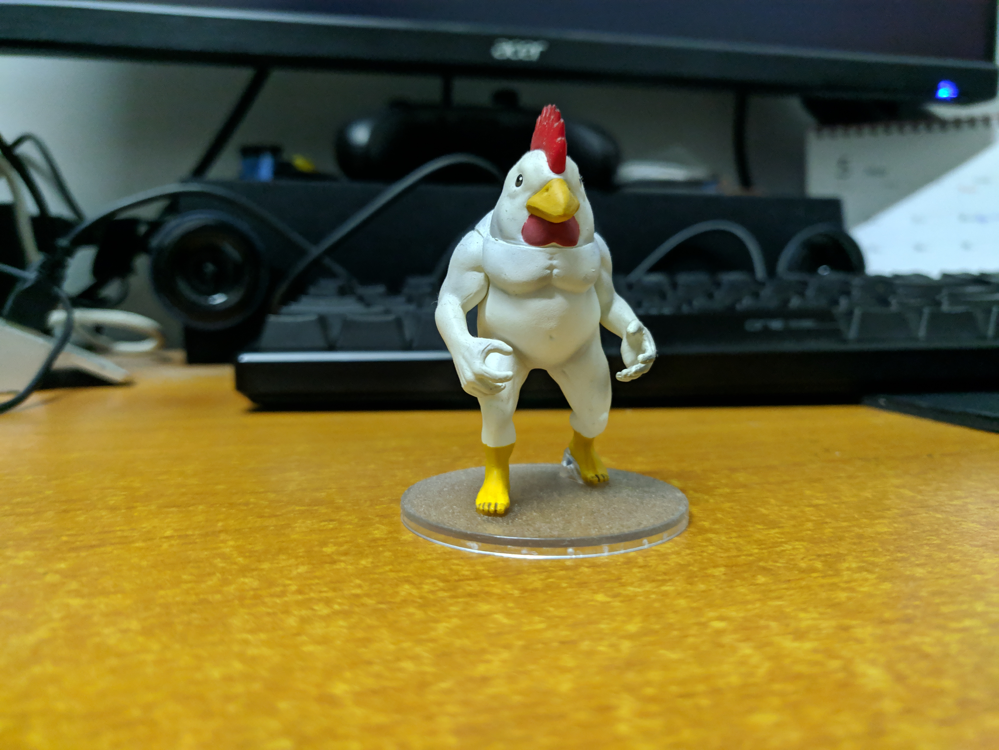
  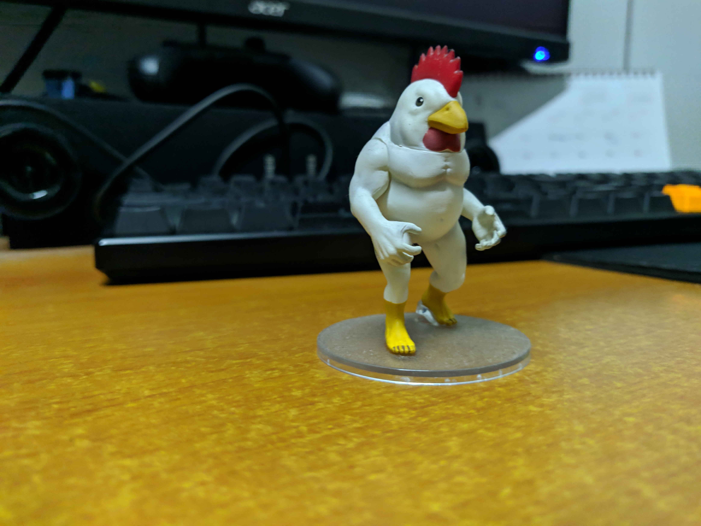  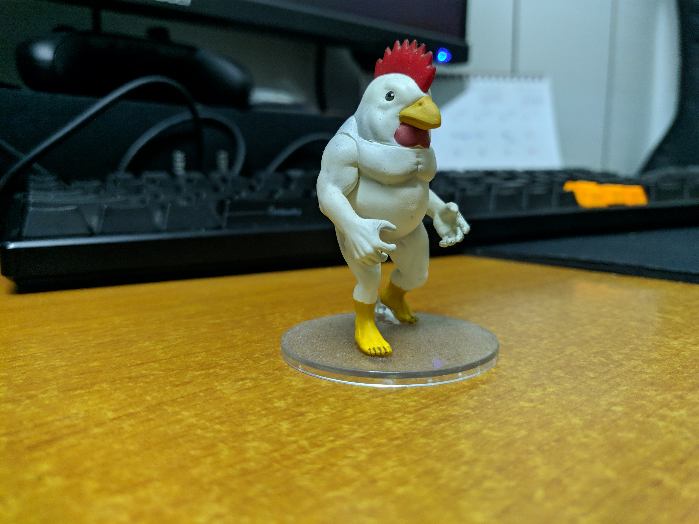
  >
   Motion parallax
  >
     
     
  >
  我們拍攝了兩組照片集來呈現兩種不同效果，肌肉雞(Stop motion)還有生茶(Motion Parallax)
   
  # 2.image alignment results between different images
   Stop Motion
  >
   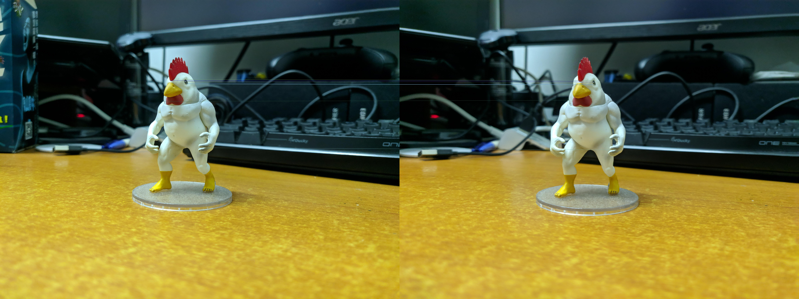  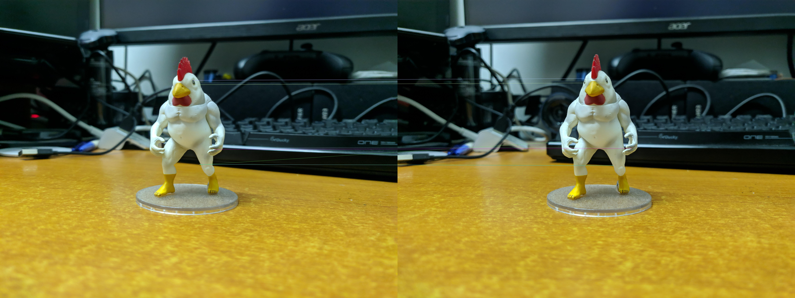
   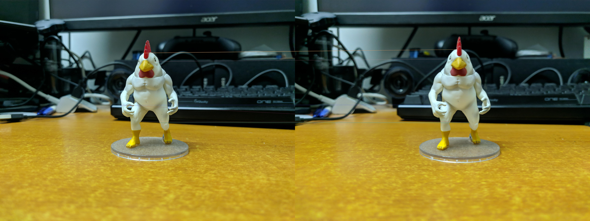  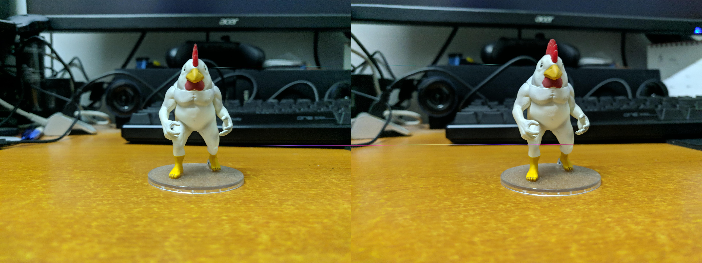
   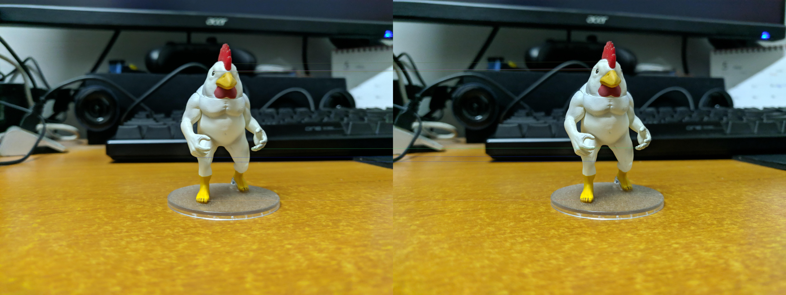  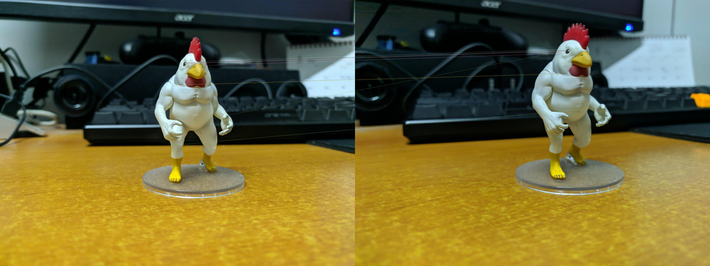
   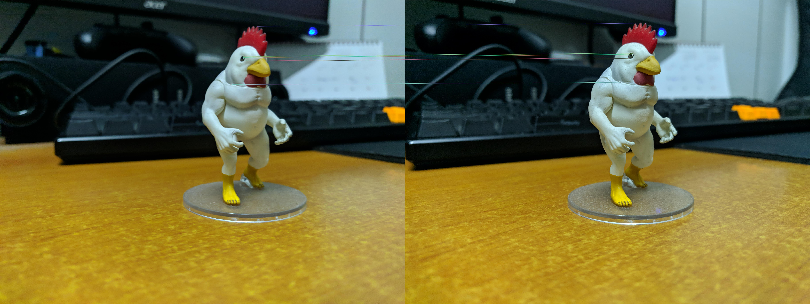
   Motion parallax
  >

   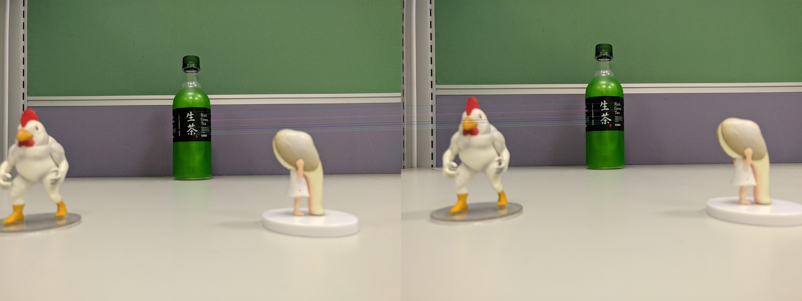
   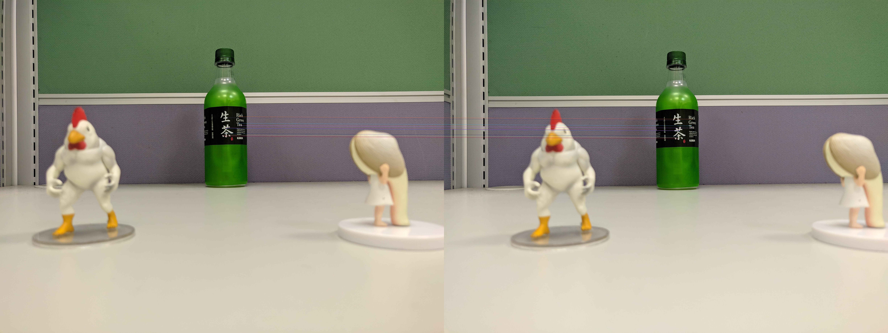
   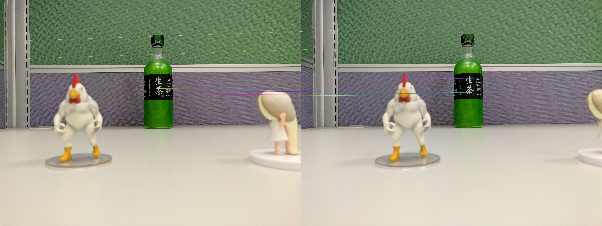

  >
 我們這次使用了ORB來對這兩組照片進行alignment，可以看出第一組的肌肉雞的身上都可以準確的對到，而第二組則是都集中對應在生茶的部分，我們認為可能是跟照片的焦距有關係，對焦的部分對於alignment來說是較容易進行的，在失焦的部分則沒辦法辨識出相近的東西。

  # 3.Generate the multi-view 3D visual effects
   Motion parallax
   
  
  
  這是我們利用第二組的生茶呈現的Motion parallax，不過由於Github沒有辦法上傳過大的檔案，所以我們將較清晰的版本放在[這裡](https://drive.google.com/open?id=1Mwkz0Smg2w6iIGZi4xVY8uzCmurDMXhf)，可以看到在畫面中因為前景遠景的距離差別形成我們想看到的Motion parallax，不過這次拍攝的前景離鏡頭太近了，所以很明顯的可以看到有失焦的情況，我們認為下一次可以讓前後兩主體都在正常的焦距下，這樣在align的時候就可以有更好的結果。
  
  
  # 4.Exploit creativity to add some image processing to enhance effect 
  
  我們發現第二組的情況下主體生茶可能會過暗，因此我們利用PS將主體調亮，呈現更好的畫面。
     
  >
    

  # 5.Bonus - Complete the above 3 different effects
   Stop Motion
  >
   
  這是我們利用第一組肌肉雞來做Stop Motion的效果，這裡也是經過壓縮的版本，高畫質版本在[這裡](https://drive.google.com/open?id=1p8CqCXyrU0zE6uIrFNODCBYgkNbNQFQB)，不過也許在畫面帶到最左邊的時候手沒有拿穩，整個畫面有些許跑掉，在alignment時會對畫面有些許的不平衡。
  
  
  [這裡](https://drive.google.com/open?id=1p8CqCXyrU0zE6uIrFNODCBYgkNbNQFQB)
  Motion Stills app
  
   
   
   # 結論
   
   我們認為最重要的是最開始照片的取景、畫面的穩定，都對於後面的處理都有很大的影響，而在畫面的背景太複雜的情況下，結果也會不太好。
   而使用PS或是AE來對照片進行修補更能夠將結果變得更好，直接操作還是更能夠展現出我們想要表達的畫面。
